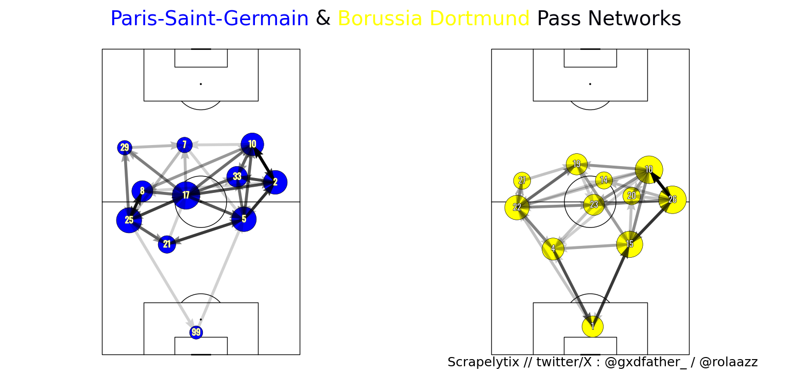

# Scrapelytix
Welcome to Scrapelytix! This package allows you to scrape football event data and visualize various metrics like pass-maps, progressive passes, shot-maps. We will show you how to scrape whoscored, sofascore and fbref to gather data in the first place.

## Installation
First, install the package using pip:
`pip install scrapelytix`

## Usage Guide
### Step 1: Prepare the Data
To use Scrapelytix, you need to provide the URL of the match scorecard from the match center you want to scrape and your User-Agent.

### Step 2: Scrape the Data
Here's a step-by-step guide to using Scrapelytix:

Import the Required Modules:
```
import re
import json
import pandas as pd
import requests
import numpy as np
from Scrapelytix.extraction import pass_data, player_data
from Scrapelytix.filter import analyze_passes, analyze_shots
from Scrapelytix.plot import pass_network, prg_passes, shot_map
```
Prompt the User for the URL:
```
url = input("Enter the URL for event data: ")
url_shots = 'https://api.sofascore.com/api/v1/event/11352376/shotmap'  
HEADERS = {
'User-Agent': "Mozilla/5.0 (Windows NT 10.0; Win64; x64) AppleWebKit/537.36 (KHTML, like Gecko) Chrome/125.0.0.0 Safari/537.36",
'Referer': "https://www.whoscored.com/",
'Accept-Language': "en-US,en;q=0.5",
'Accept-Encoding': "gzip, deflate, br",
'Connection': "keep-alive",
'Upgrade-Insecure-Requests': "1",
'TE': "Trailers"
}
```
Extract Player and Pass Data:
```
players_df, df_passes = player_data(url, HEADERS)
print(players_df.head())
print(df_passes.head())
```
Analyze Passes:
```
# Extracting team ids
team_ids = df_passes['teamId'].unique()

# Defining home and away colours for each team
home_colors = ['#FF0000', '#0000FF']  # Example colors (replace with actual colors)
away_colors = ['#FFFFFF', '#FFFFFF']  # Example colors (replace with actual colors)

# Creating DataFrame for clubs with team IDs and labels
df_clubs = pd.DataFrame({'Team ID': team_ids, 'Team Label': ['Team X', 'Team Y'], 'Team Name': ['Team X', 'Team Y'], 'Home Color': home_colors, 'Away Color': away_colors})

# Assuming there are only two teams, you can assign home and away team IDs accordingly
home_team_id = team_ids[0]
away_team_id = team_ids[1]

pass_between_home, pass_between_away, avg_loc_home, avg_loc_away, passes_home, passes_away, df_prg_home, df_comp_prg_home, df_uncomp_prg_home, df_prg_away, df_comp_prg_away, df_uncomp_prg_away = analyze_passes(df_passes, players_df, home_team_id, away_team_id)

# Example print statements to verify the results
print("Passes Between Home Players:")
print(pass_between_home.head())

print("Average Locations of Home Players:")
print(avg_loc_home.head())

print("Home Team Progressive Passes:")
print(df_prg_home.head())
```
Visualize the Data:
```
# Pass Network Visualization
pass_network(pass_between_home, pass_between_away, avg_loc_home, avg_loc_away, home_team_id, away_team_id, df_clubs)

# Progressive Passes Visualization
prg_passes(df_comp_prg_home, df_uncomp_prg_home, df_comp_prg_away, df_uncomp_prg_away, home_team_id, away_team_id, df_clubs)
```

## Output Samples

To better illustrate the steps, you can include screenshots of the outputs after each significant step. This will help users understand the intermediate results and the final visualizations.

1. **Pass Network Visualization:**
   - 

2. **Progressive Passes Visualization:**
   - 

### Conclusion

Scrapelytix makes it easy to scrape football match data and visualize important statistics. By following the steps above, you can analyze and visualize data for any match you are interested in.

Feel free to explore the package and provide feedback or contributions on GitHub!

### Contribution

Contributions are welcome! If you find any issues or have suggestions, please open an issue or create a pull request on the [GitHub repository](https://github.com/gxdfather7/Scrapelytix).

### License

This project is licensed under the MIT License. See the [LICENSE](LICENSE) file for details.
